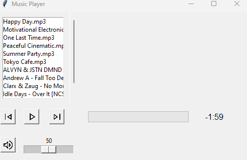
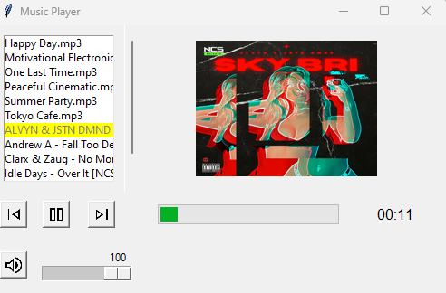
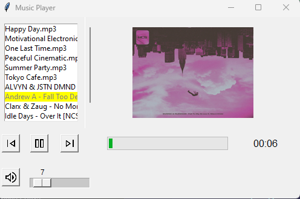

# Music Player App

A simple music player application built using Python and the Tkinter GUI framework. The application allows users to play, pause, skip, and control the volume of songs in a playlist. It also displays the current playback time and provides a progress bar to show the song's playback progress.

## Table of Contents

- [Features](#features)
- [Installation](#installation)
- [Usage](#usage)
- [Screenshots](#screenshots)
- [Contributing](#contributing)
- [License](#license)

## Features

- Play, pause, and skip functionality.
- Control the volume level.
- Display the current playback time.
- Show the playback progress using a progress bar.
- Interactive song selection through a listbox.
- Cover art displayed alongside the song list.
- User-friendly GUI built with Tkinter.
- Compatible with MP3 audio format.

## Installation
1. **Prerequisites:** Make sure you have Python and the `pygame` library installed.

    ```sh
    pip install pygame
    ```

2. **Clone Repository:** Clone this repository to your local machine.

    ```sh
    git clone https://github.com/your-username/music-player-app.git
    ```

3. **Navigate to Directory:** Change into the project directory.

    ```sh
    cd music-player-app
    ```

4. **Run the App:** Execute the main Python file to start the application.

    ```sh
    python main.py
    ```
## Usage

1. **Launch the App:** Double-click the `main.py` file or run it using the terminal.

    ```sh
    python main.py
    ```

2. **Song List:** The main window displays a list of songs from the playlist. Click on a song to select it.

3. **Controls:**
    - **Play/Pause Button:** Click the play button to start playing the selected song. Click it again to pause the song.
    - **Next Button:** Click to skip to the next song in the playlist.
    - **Previous Button:** Click to go back to the previous song.

4. **Volume Control:**
    - Use the volume slider to adjust the playback volume of the song.

5. **Time Display and Progress:**
    - The time display shows the elapsed time of the currently playing song.
    - The progress bar indicates the playback progress of the song.

6. **Cover Art:**
    - The cover art image changes according to the currently playing song.

7. **Exiting the App:**
    - Close the application window to exit the music player.

Enjoy listening to your favorite tunes with this simple and intuitive music player app!


## Screenshots






## Contributing

Contributions are welcome! If you have any improvements, bug fixes, or new features to add, feel free to submit a pull request.

1. Fork the repository.
2. Create a new branch: `git checkout -b feature-name`.
3. Make your changes and commit them: `git commit -m 'Add some feature'`.
4. Push to the branch: `git push origin feature-name`.
5. Open a pull request.

Please ensure that your pull request adheres to the project's coding guidelines and follows the existing code style.

## License

This project is licensed under the [MIT License](LICENSE).


